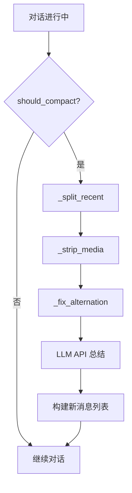

# compact.py Analysis

## 文件概述
`compact.py` 实现对话上下文压缩功能，通过调用 LLM API 将旧消息总结为精简版本，释放 token 空间。设计模式对标 claude-code 的 `src/services/compact/compact.ts`。

## 核心常量

### Token 估计与阈值
```python
CHARS_PER_TOKEN = 4              # 每个 token 的字符数（粗略估计）
COMPACT_THRESHOLD_TOKENS = 100_000  # 触发自动压缩的 token 阈值
MIN_RECENT_MESSAGES = 6           # 至少保留最近的 6 条消息
MIN_RECENT_TOKENS = 10_000        # 至少保留最近 10k 个 token
COMPACT_MAX_OUTPUT_TOKENS = 4096  # 压缩结果的最大输出 token 数
AUTOCOMPACT_BUFFER_TOKENS = 13_000 # 上下文缓冲区，防止频繁触发
```

### 上下文窗口配置
```python
_CONTEXT_WINDOWS = [
    ("claude-opus-4-6", 1_000_000),
    ("claude-sonnet-4-6", 1_000_000),
    ("claude-3-5-sonnet", 8192),
    # ... 更多模型配置
]
_DEFAULT_CONTEXT_WINDOW = 200_000
```

### 压缩提示模板
```python
COMPACT_PROMPT = """
Please provide a detailed summary of our conversation so far. This summary 
will *replace* the earlier messages to free up context space, so it must 
preserve every detail needed to continue the work seamlessly.

Structure your response with these sections:

## Primary Request
What the user is trying to accomplish overall.

## Key Technical Concepts
Important technical details, patterns, frameworks, or constraints established.

## Files and Code
Key files discussed or modified, with brief notes on what was done to each.

## Errors and Fixes
Any errors encountered and how they were resolved.

## Current Work
What was being worked on most recently and its current status.

## Pending Tasks
Outstanding work items or next steps that have not yet been completed.

Focus on preserving information that will be needed to continue the work.
Be specific — include file paths, function names, error messages, and 
concrete decisions rather than vague summaries.
"""

COMPACT_SYSTEM = "You are a conversation summarizer. Produce a structured, detailed summary following the user's requested format."
```

## 核心函数

### 1. _text_of
```python
def _text_of(content: Any) -> str:
    """从消息内容中提取纯文本（str、blocks 列表等）。"""
```

**功能**：
- `str`: 直接返回
- `list`: 遍历 blocks，收集 text、content、input 字段
- 其他类型：转为字符串

**处理逻辑**：
```python
if isinstance(content, str):
    return content
elif isinstance(content, list):
    parts = []
    for block in content:
        if isinstance(block, dict):
            parts.append(block.get("text", ""))  # text block
            parts.append(block.get("content", "") if isinstance(block.get("content"), str) else "")  # tool_result content
            parts.append(str(block.get("input", "")))  # tool_use input
        elif hasattr(block, "text"):
            parts.append(block.text)
        elif hasattr(block, "input"):
            parts.append(str(block.input))
    return " ".join(parts)
else:
    return str(content) if content else ""
```

### 2. estimate_tokens
```python
def estimate_tokens(messages: list[dict]) -> int:
    """粗略 token 估计：总字符数 / CHARS_PER_TOKEN。"""
    total_chars = sum(len(_text_of(msg.get("content", ""))) for msg in messages)
    return total_chars // CHARS_PER_TOKEN
```

**用途**：当无法获取 API 返回的实际 token 消耗时，用字符数粗略估算。

### 3. should_compact
```python
def should_compact(messages: list[dict], model: str | None = None,
                   last_input_tokens: int | None = None) -> bool:
    """判断对话是否应该自动压缩。

    若有 last_input_tokens（来自 API 响应），使用模型感知的阈值（匹配 autoCompact.ts）。
    否则回退到基于字符的估计。
    """
    if last_input_tokens and model:
        # 精确阈值：使用 API 返回的输入 token 数
        return last_input_tokens >= _auto_compact_threshold(model)
    else:
        # 粗略阈值：使用字符估计
        return estimate_tokens(messages) > COMPACT_THRESHOLD_TOKENS
```

### 4. _auto_compact_threshold
```python
def _auto_compact_threshold(model: str) -> int:
    """计算模型的自动压缩阈值：context_window - max_output_reserve - buffer。"""
    cw = _context_window_for_model(model)
    max_out_reserve = min(20_000, cw // 5)  # 为 summary 输出预留
    return cw - max_out_reserve - AUTOCOMPACT_BUFFER_TOKENS
```

**设计要点**：
- 为 summary 输出预留约 20k token（不超过 context_window 的 5%）
- 留出 13k token 作为缓冲区（防止频繁触发压缩）

### 5. _split_recent
```python
def _split_recent(messages: list[dict]) -> tuple[list[dict], list[dict]]:
    """将消息划分为 (history_to_summarise, recent_to_keep)。

    从后向前遍历，保留最近 MIN_RECENT_MESSAGES 和 MIN_RECENT_TOKENS 的消息。
    保证不会拆分 tool_use/tool_result 配对。
    """
```

**核心逻辑**：
1. 从后向前遍历消息
2. 累计 token 数和消息数，直到满足保留阈值
3. 特殊处理：不拆分 tool_use 和 tool_result 配对
   - 若 `keep_start` 落在 user 消息且内容全是 tool_result，则向前扩展一条 assistant 消息（包含 tool_use）

### 6. CompactService
```python
class CompactService:
    """通过 API 总结来压缩对话上下文。"""
```

#### init
```python
def __init__(self, client: LLMClient, model: str, effort: str | None = None):
```

#### compact
```python
def compact(
    self,
    messages: list[dict],
    system_prompt: str,
    custom_instructions: str = "",
) -> tuple[list[dict], str]:
    """总结 *messages*，返回 (新消息列表，summary 文本)。

    返回的消息列表结构：
        [user: summary] [assistant: ack] [recent messages …]
    """
```

**执行流程**：
1. **划分消息**：调用 `_split_recent`
2. **清理历史消息**：调用 `_strip_media` 移除 images/documents
3. **构建压缩请求**：
   - 加入 COMPACT_PROMPT 作为 user 消息
   - 确保消息列表以 user 开头（若不是则插入虚拟 user 消息）
   - 确保角色交替（调用 `_fix_alternation`）
4. **调用 LLM API**：创建消息（创建 summary）
5. **构建新消息列表**：
   ```python
   [
       {"role": "user", "content": "[summary of conversation]..."},
       {"role": "assistant", "content": "Understood, ready to continue..."},
       ... 最近的消息 ...
   ]
   ```

**特殊处理**：
- 若 summary 为空，返回 `"(compact produced empty summary)"`

## 辅助函数

### _strip_media
```python
def _strip_media(messages: list[dict]) -> list[dict]:
    """返回移除 images/documents 的消息副本。"""
```

**处理逻辑**：
```python
for msg in messages:
    if isinstance(content, list):
        new_blocks = []
        for block in content:
            if btype == "image":
                new_blocks.append({"type": "text", "text": "[image]"})
            elif btype == "document":
                new_blocks.append({"type": "text", "text": "[document]"})
            else:
                new_blocks.append(block)
    # ... 保持原有文本消息 ...
```

### _fix_alternation
```python
def _fix_alternation(messages: list[dict]) -> list[dict]:
    """确保严格的用户/assistant 交替（API 要求）。"""
```

**处理逻辑**：
```python
if not messages:
    return messages

fixed = [messages[0]]
for msg in messages[1:]:
    if msg.role == fixed[-1].role:
        # 合并到上一条消息
        prev_content = fixed[-1].content
        cur_content = msg.content
        if 两者都是 str:
            fixed[-1].content = prev_content + "\n" + cur_content
        else:
            # 转为 list 后拼接
            fixed[-1].content = _as_list(prev_content) + _as_list(cur_content)
    else:
        fixed.append(msg)

return fixed
```

## 使用流程



## 设计特点

1. **精确 vs 粗略阈值**：优先使用 API 返回的 token 数，回退到字符估计
2. **保留最近消息**：保证历史末尾的交互不被压缩
3. **保持 tool_use/tool_result 配对**：避免上下文断裂
4. **移除媒体文件**：节省 token 空间（仅保留占位符）
5. **确保角色交替**：符合 API 要求

## 返回值结构

```python
new_messages: [
    {"role": "user", "content": "[summary block 1]\n[summary block 2]..."},
    {"role": "assistant", "content": "Understood, ready to continue..."},
    {"role": "user", "content": "<original user message 1>"},
    {"role": "assistant", "content": "<original assistant response 1>"},
    # ... 其余最近的消息 ...
]
```

## 依赖模块
- `llm.LLMClient`：用于调用 LLM API 进行总结
